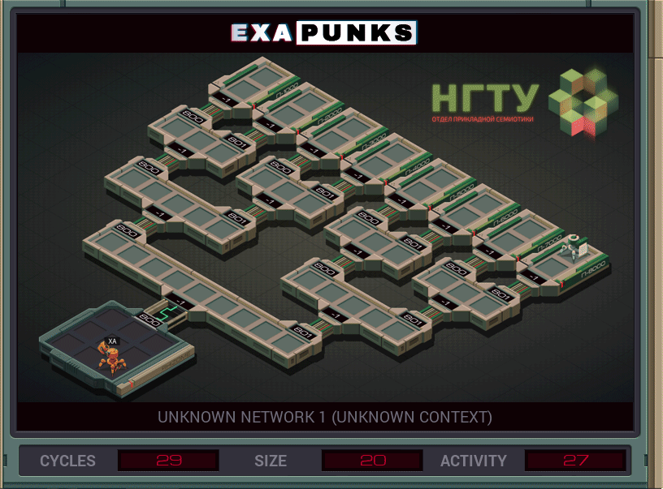

# 10: Unknown Network 1 (Unknown Context)
<div align='center'></div>
n
## Instructions
>Find file 276 in the network and bring it back to your host.
>
>Note that an EXA cannot grab a file that is being held by another EXA.

## Solution

### [XA](XA.exa) (GLOBAL)
```asm
LINK 800
REPL ONE
MARK ZERO
LINK 800
JUMP NEXT
MARK ONE
LINK 801
MARK NEXT
ADDI X 1 X
TEST X = 3
TJMP END
REPL ONE
JUMP ZERO
MARK END
KILL
GRAB 276
@REP 4
LINK -1
@END
```