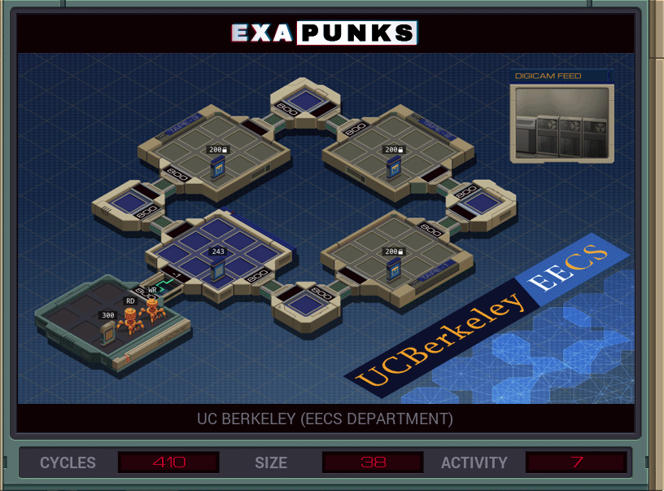

# 11: UC Berkeley (EECS Department)
<div align='center'></div>
n
## Instructions
>Locate the specified host (either *tape-1*, *tape-2*, or *tape-3*), and then locate the specified entry (‗ПАСЬЯНС‗) in the tape backup file in that host (file 200). Create a file in your host containing the entry's data.
>
>The names of the target host and entry are available in file 300.
>
>For more information see "Accessing Data in Legacy Storage Systems" in the first issue of the zine.

## Solution

### [RD](RD.exa) (GLOBAL)
```asm
GRAB 300
COPY F X
LINK 800
LINK 800
LINK 800
MARK FHOST
HOST T
TEST X = T
TJMP HOSTED
LINK 800
LINK 800
JUMP FHOST
MARK HOSTED
COPY F X
WIPE
GRAB 200
MARK FMETA
TEST F = X
FJMP FMETA
COPY F T
COPY F X
COPY X M
SEEK -9999
SEEK T
MARK SEND
COPY F M
SUBI X 1 X
TEST X = 0
FJMP SEND
HALT
```

### [WR](WR.exa) (GLOBAL)
```asm
MAKE
COPY M X
MARK LOOP
COPY M F
SUBI X 1 X
TEST X = 0
FJMP LOOP
HALT
```