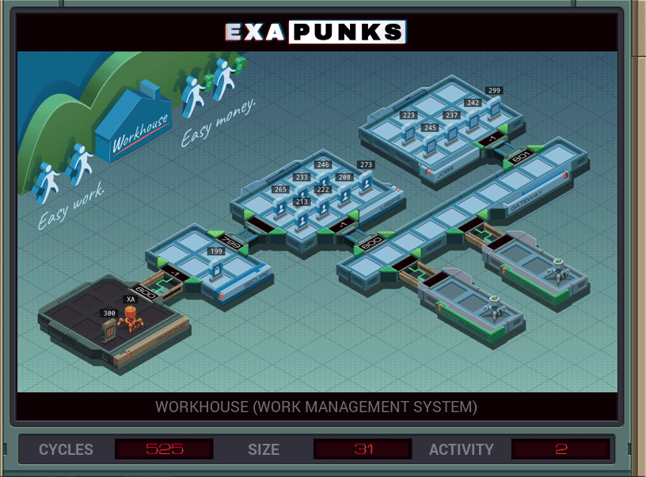

# 12: Workhouse (Work Management System)
<div align='center'></div>
n
## Instructions
>Locate EMBER-2's user file in the *users* host and overwrite it so that the sum of the values is the same but no individual value exceeds $75. All values, except for the last, must be the maximum value ($75). You will need to add additional values to accomplish this.
>
>EMBER-2's username is available in file 300.
>
>Note that the sum of the values in EMBER-2's account will always be less than $10,000.
>
>For more information see "Network Exploration: Workhouse" in the first issue of the zine.

## Solution

### [XA](XA.exa) (GLOBAL)
```asm
GRAB 300
COPY F X
WIPE
LINK 800
GRAB 199
MARK FNAME
TEST F = X
SEEK 2
FJMP FNAME
SEEK -1
COPY F X
DROP
LINK 799
GRAB X
SEEK 2
COPY 0 X
MARK SUM
ADDI X F X
TEST EOF
FJMP SUM
SEEK -9999
SEEK 2
MARK WRITE
COPY 75 F
SUBI X 75 X
TEST X < 75
FJMP WRITE
TEST X = 0
TJMP HALT
COPY X F
MARK HALT
```