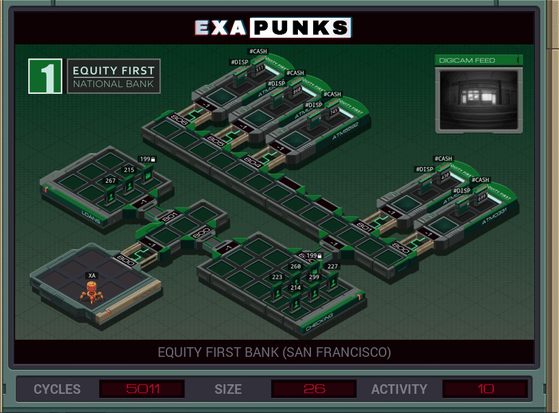

# 13: Equity First Bank (San Fancisco)
<div align='center'></div>
n
## Instructions
>Dispense all available cash from all connected ATMs.
>
>For more information see "Network Exploration: Equity First Bank" in the first issue of the zine.

## Solution

### [XA](XA.exa) (GLOBAL)
```asm
LINK 800
LINK 800
LINK 800
COPY 806 X
REPL START
COPY 805 X
REPL START
COPY 804 X
REPL START
COPY 803 X
REPL START
COPY 802 X
REPL START
COPY 801 X
REPL START
COPY 800 X
MARK START
LINK X
COPY #CASH X
MARK LOOP
TEST X = 0
TJMP HALT
COPY 20 #DISP
SUBI X 1 X
JUMP LOOP
MARK HALT
```