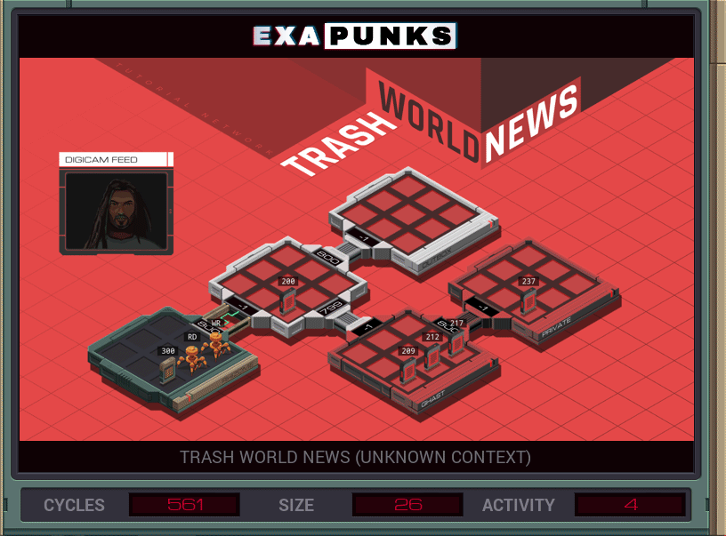

# 15: Trash World News (Unknown Context)
<div align='center'></div>
n
## Instructions
>Find and replace the keywords in the target message (file 212) as directed by EMBER-2.
>
>A list of keyword pairs indicating which words should be found and what they should be replaced with is available in file 300. For example, the keyword ‗AI‗ should be replaced with the keyword ‗COLLECTIVE‗. Each keyword will only occur once, but may occur in any order.
>
>Also, move file 200 to the *outbox*.

## Solution

### [RD](RD.exa) (GLOBAL)
```asm
GRAB 300
MARK READ
COPY F M
COPY F M
TEST EOF
FJMP READ
COPY -1 M
WIPE
LINK 800
GRAB 200
LINK 800
```

### [WR](WR.exa) (GLOBAL)
```asm
LINK 800
LINK 799
GRAB 212
MARK WRITE
COPY M X
TEST X = -1
TJMP HALT
MARK SEARCH
TEST F = X
FJMP SEARCH
SEEK -1
COPY M F
SEEK -9999
JUMP WRITE
MARK HALT
```