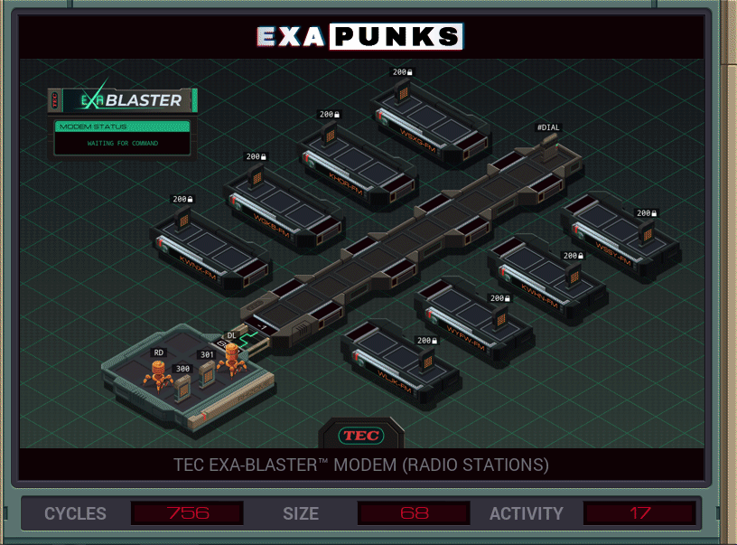

# 18: TEC EXA-Blaster Modem (Radio Stations)
<div align='center'></div>

## Instructions
>Connect to each radio station and replace every song in the playlist (file 200) with ‗CAN'T (NOT) GET OVER YOU‗ by ‗ME2U‗ (file 300). Each song in a playlist consists of two keywords: the song name and the artist name.
>
>A list of phone numbers for the radio stations is available in file 301.
>
>Note that EXAs in global mode can only communicate if there is a path of links connecting them.
>
>For more information see "Hacker Skills: Modem Control at the Direct Level" in the second issue of the zine.


## Solution

### [DL](DL.exa) (LOCAL)
```asm
GRAB 301
LINK 800
MARK LOOP
COPY -1 #DIAL
@REP 11
COPY F #DIAL
@END
REPL RUN
VOID M
TEST EOF
FJMP LOOP
WIPE
HALT

MARK RUN
LINK 800
GRAB 200
MODE
COPY M X
MARK WNAME
COPY X F
SEEK 1
TEST EOF
FJMP WNAME
COPY M X
SEEK -9999
SEEK 1
MARK WARTIST
COPY X F
SEEK 1
TEST EOF
FJMP WARTIST
DROP
LINK -1
MODE
COPY -1 M
```

### [RD](RD.exa) (GLOBAL)
```asm
GRAB 300
@REP 8
COPY F M
COPY F M
SEEK -9999
@END
```