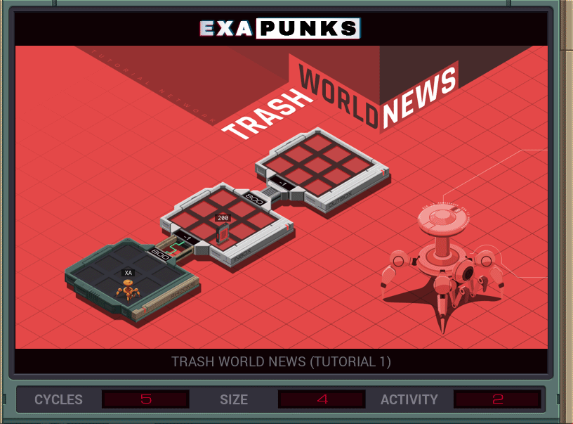

# 1: Trash World News (Tutorial 1)
<div align='center'></div>

## Instructions
>Move file 200 to the *outbox*.
>
>This task, like most tasks, requires you to _leave no trace_. You must terminate all of your EXAs, not leave any extraneous files in the network, and not make any changes to the network other than those specified by the task's requirements.
>
>For help completing this task see "Ghast Walks U Thru It" in the first issue of the zine.

## Solution

### [XA](XA.exa) (GLOBAL)
```asm
LINK 800
GRAB 200
LINK 800
DROP
```