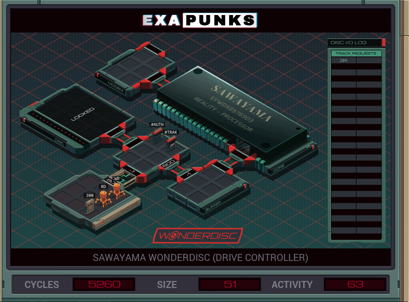

# 21: Sawayama Wonderdisc (Drive Controller)
<div align='center'></div>
n
## Instructions
>Modify your WonderDisc, which normally only plays SSEA region games, to play games from any region.
>
>The SSEA region code is available in file 300.
>
>It is not necessary to leave no trace. Your EXAs should be written to operate indefinitely.
>
>For more information see "Hardware Hacks: Sawayama WonderDisc" in the second issue of the zine.

## Solution

### [RD](RD.exa) (GLOBAL)
```asm
LINK 800
COPY 8 #AUTH
COPY 0 #AUTH
COPY 3 #AUTH
COPY 2 #AUTH
COPY 7 #AUTH
COPY 1 #AUTH
COPY 0 #AUTH
COPY 4 #AUTH
COPY 9 #AUTH
COPY 5 #AUTH
COPY 1 #AUTH
COPY 2 #AUTH
COPY 5 #AUTH
COPY 2 #AUTH
COPY 6 #AUTH
LINK 801
MARK LOOP
GRAB M
MARK SEND
COPY F M
TEST EOF
FJMP SEND
DROP
COPY -9999 M
JUMP LOOP
```

### [WR](WR.exa) (GLOBAL)
```asm
GRAB 300
COPY F X
WIPE
LINK 800
MARK LOOP
COPY #TRAK M
LINK 800
MAKE
MARK WRITE
COPY M F
SEEK -1
TEST F > -9998
TJMP WRITE
SEEK -1
TEST F = -9999
TJMP NEXT
SEEK -1
COPY X F
JUMP WRITE
MARK NEXT
SEEK -1
VOID F
DROP
LINK -1
JUMP LOOP
```