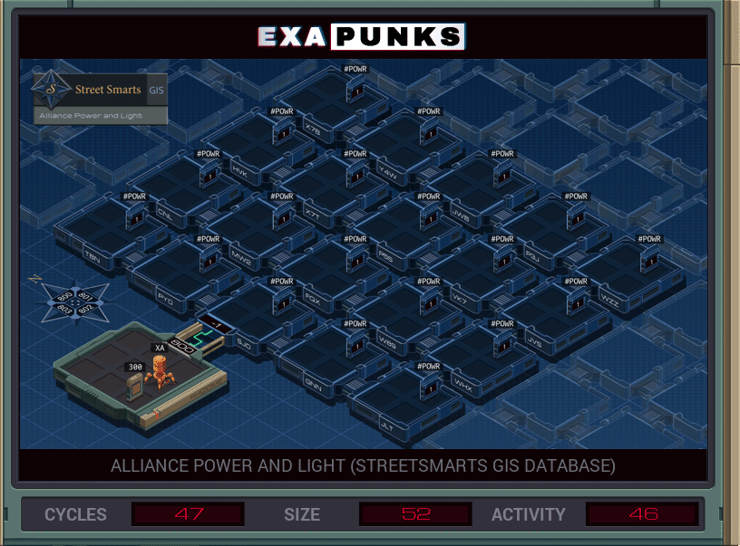

# 22: Alliance Power and Light (Streetsmarts GIS Database)
<div align='center'></div>

## Instructions
>Locate the two hosts with the specified hostnames (file 300), which correspond to the target power grid substations. When you've found them, cut the power by writing a value of 0 to #POWR.
>
>For more information see "Network Exploration: Geographic Information Systems" in the second issue of the zine.

## Solution

### [XA](XA.exa) (GLOBAL)
```asm
LINK 800
LINK 802
LINK 802
REPL NORTH
REPL EAST
COPY 0 #POWR

MARK NORTH
LINK 800
REPL NORTH
COPY 0 #POWR

MARK EAST
LINK 801
REPL NORTH
REPL EAST
COPY 0 #POWR
```