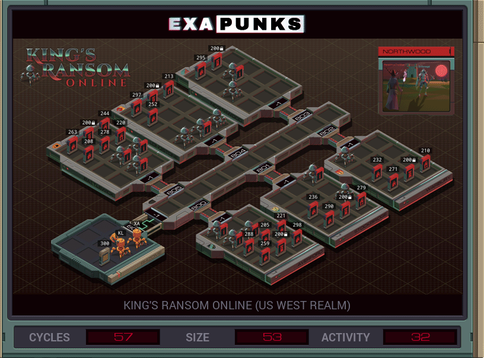

# 24: King's Ransom Online (US West Realm)
<div align='center'></div>

## Instructions
>Reset the ownership of all castles and sub-buildings to ‗P00000‗ (file 300), the player ID for unowned buildings.
>
>To ensure that there are no witnesses you must first disconnect all connected players. Terminate every EXA in every host before changing any castle or sub-building files anywhere in the network. If you leave an EXA alive in one host while changing a file in another you will fail the task.
>
>For more information see "Network Exploration: King's Ransom Online" in the second issue of the zine.

## Solution

### [KL](KL.exa) (GLOBAL)
```asm
LINK 800
@REP 6
COPY @{800,1} X
REPL KILL
@END
@REP 4
NOOP
@END
COPY 200 M
HALT
MARK KILL
LINK X
KILL
KILL
KILL
```

### [XA](XA.exa) (GLOBAL)
```asm
GRAB 300
COPY F X
WIPE
LINK 800
VOID M
@REP 6
COPY @{800,1} T
REPL CLEAR
@END
HALT
MARK CLEAR
LINK T
COPY 200 T
MARK RECURSE
GRAB T
SEEK 2
COPY X F
MARK LOOP
TEST EOF
TJMP WIPE
COPY F T
REPL RECURSE
JUMP LOOP

MARK WIPE
WIPE
```

### [XB](XB.exa) (GLOBAL)
```asm
COPY 50 T
MARK SLEEP
SUBI T 1 T
TJMP SLEEP
LINK 800
@REP 6
COPY @{800,1} T
REPL RUN
@END
HALT

MARK RUN
LINK T
COPY 201 X
MARK LOOP
REPL GRAB
ADDI X 1 X
TEST X = 300
FJMP LOOP
HALT

MARK GRAB
GRAB X
LINK -1
LINK -1
```