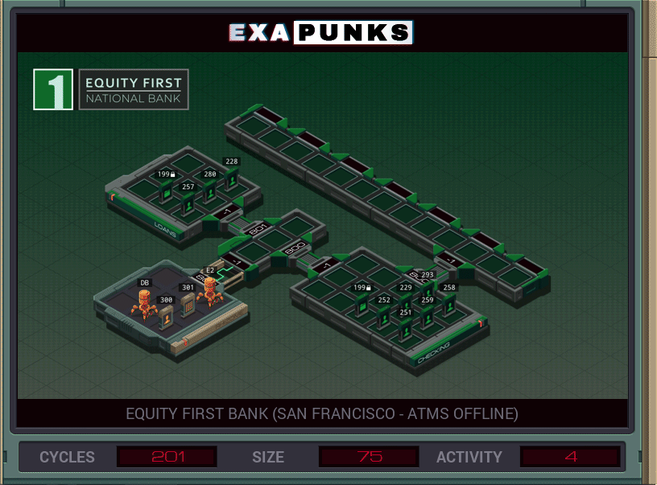

# 26: Equity First Bank (San Francisco (ATMs Offline)
<div align='center'></div>
n
## Instructions
>Move EMBER-2's new account (file 300) into *checking*. Then iterate over the checking accounts listed in the directory (file 199) and, in that order, transfer $1.00 from each target account to EMBER-2's account. Finally, add the file ID of EMBER-2's account file to the end of the directory.
>
>The keywords ‗CREDIT‗ and ‗DEBIT‗ are available in file 301.
>
>For more information see "Network Exploration: Equity First Bank" in the first issue of the zine.

## Solution

### [E2](E2.exa) (LOCAL)
```asm
GRAB 300
LINK 800
LINK 800
DROP
GRAB 301
COPY F X
DROP
VOID M
REPL READ
MARK WLOOP
GRAB M
COPY F T
DROP
GRAB 300
SEEK 9999
COPY T F
COPY X F
COPY 1 F
COPY 0 F
DROP
TEST MRD
TJMP WLOOP
GRAB 199
SEEK 9999
COPY 300 F
DROP
GRAB 301
WIPE
HALT

MARK READ
GRAB 199
MARK RLOOP
COPY F M
JUMP RLOOP
```

### [DB](DB.exa) (LOCAL)
```asm
GRAB 301
LINK 800
LINK 800
DROP
GRAB 300
COPY F X
DROP
GRAB 199
MARK IDLOOP
COPY F T
REPL ID
TEST EOF
TJMP NEXT
JUMP IDLOOP
MARK NEXT
DROP
GRAB 301
SEEK 1
COPY F X
DROP
GRAB 199
MARK DEBITLOOP
COPY F T
REPL DEBIT
TEST EOF
TJMP END
JUMP DEBITLOOP
MARK END
COPY 200 M
HALT

MARK ID
GRAB T
SEEK 9999
COPY X F
HALT

MARK DEBIT
GRAB T
SEEK 9999
COPY X F
COPY 1 F
COPY 0 F
```