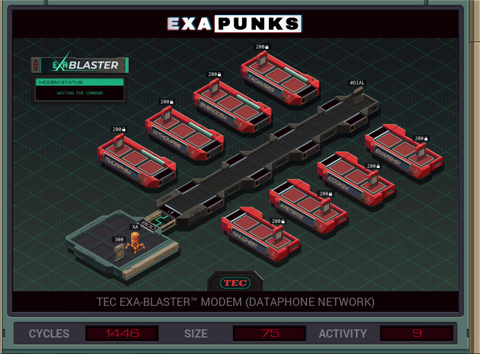

# 27: TEC EXA-Blaster Modem (Dataphone Network)
<div align='center'></div>
n
## Instructions
>Using your modem, connect to each dataphone so that EMBER-2 will have a list of valid phone numbers.
>
>Each dataphone contains a list of the owner's contacts (file 200). The phone number of one of these dataphones is in your host (file 300), while the rest are in the contact list of another dataphone.
>
>Note that each dataphone (aside from the first) will appear in exactly one other dataphone's contact list, in such a way that you can find them all without getting stuck in a loop.
>
>For more information see "Hacker Skills: Modem Control at the Direct Level" in the second issue of the zine.

## Solution

### [XA](XA.exa) (GLOBAL)
```asm
GRAB 300
LINK 800
MARK LOOP
COPY -1 #DIAL
SEEK -9999
TEST EOF
TJMP HALT
@REP 11
COPY F #DIAL
@END
REPL RUN
SEEK -9999
@REP 11
VOID F
@END
SEEK 9999
MARK WRITE
@REP 4
NOOP
@END
TEST MRD
FJMP LOOP
TEST M = -1
TJMP LOOP
@REP 11
COPY M F
@END
FJMP WRITE
MARK HALT
WIPE

MARK RUN
LINK 800
GRAB 200
MARK READ
COPY 1 M
SEEK 1
@REP 11
COPY F M
@END
TEST EOF
FJMP READ
COPY -1 M
```