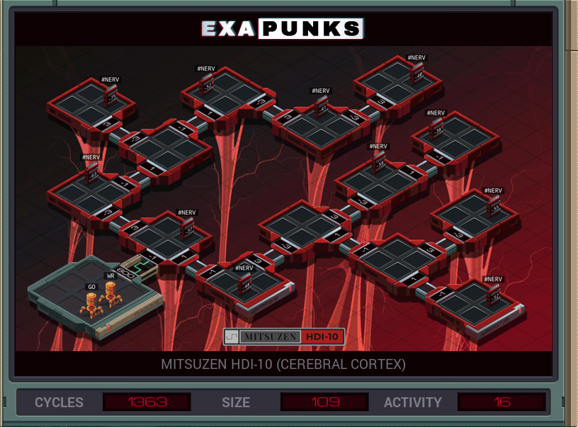

# 34: Mitsuzen HDI-10 (Cerebral Cortex)}
<div align='center'></div>
n
## Instructions
>Create a file in your host containing the hostname and hardware register value of each neuron exactly once, sorted as pairs from lowest to highest hostname.
>
>Note that each test run has its own unique network layout.
>
>For more information see "Debugging the Phage" in the first issue of the zine.

## Solution

### [GO](GO.exa) (GLOBAL)
```asm
LINK 800
MARK START
REPL 1
REPL 3
REPL N3
JUMP SETUP
MARK 1
LINK 1
REPL 1
REPL 3
REPL N3
JUMP SETUP
MARK N1
LINK -1
REPL N1
REPL 3
REPL N3
JUMP SETUP
MARK 3
LINK 3
REPL 1
REPL N1
REPL 3
JUMP SETUP
MARK N3
LINK -3
REPL 1
REPL N1
REPL N3
JUMP SETUP

MARK SETUP
COPY #NERV M
COPY 50 T
MARK WAIT1
SUBI T 1 T
TJMP WAIT1
COPY M T
MARK WAIT2
SUBI T 1 T
TJMP WAIT2
HOST M
COPY #NERV M
```

### [WR](WR.exa) (GLOBAL)
```asm
COPY 25 T
MARK WAIT1
SUBI T 1 T
TJMP WAIT1
MARK COUNT
TEST MRD
FJMP SEND
VOID M
ADDI X 1 X
JUMP COUNT
MARK SEND
COPY X T
MAKE
COPY X F
SEEK -1
MARK SENDLOOP
MULI T 15 X
COPY X M
SUBI T 1 T
TJMP SENDLOOP
COPY F T
WIPE
MAKE
MARK RECVLOOP
COPY M F
COPY M F
SUBI T 1 T
TJMP RECVLOOP
REPL WRITE
MARK STARTSORT
SEEK -9999
TEST EOF
TJMP ENDSORT
COPY F X
MARK SORTLOOP
SEEK 1
TEST EOF
TJMP NEXTSORT
TEST F < X
FJMP SORTLOOP
SEEK -1
COPY F X
JUMP SORTLOOP
MARK NEXTSORT
COPY X M
SEEK -9999
MARK NEXTSEARCH
TEST F = X
FJMP NEXTSEARCH
COPY F M
SEEK -2
VOID F
VOID F
JUMP STARTSORT

MARK WRITE
MAKE
MARK WRITELOOP
COPY M X
TEST X = -1
TJMP HALT
COPY X F
COPY M F
JUMP WRITELOOP

MARK ENDSORT
WIPE
COPY -1 M
MARK HALT
```