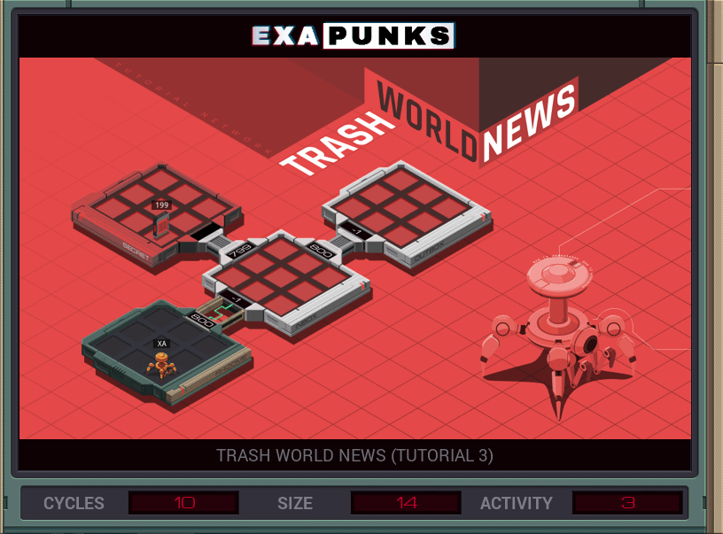

# 3: Trash World News (Tutorial 3)
<div align='center'></div>

## Instructions
>File 199 contains exactly two values: a keyword and a number. Create a new file in the *outbox* and copy those two values to it, swapping their order so that the number is first. When you are finished, delete file 199.
>
>For help completing this task see "Ghast Walks U Thru It" in the first issue of the zine.

## Solution

### [XA](XA.exa) (GLOBAL)
```asm
LINK 800
REPL BRANCH
LINK 800
MAKE
COPY M X
COPY M F
COPY X F
HALT

MARK BRANCH
LINK 799
GRAB 199
COPY F M
COPY F M
WIPE
```