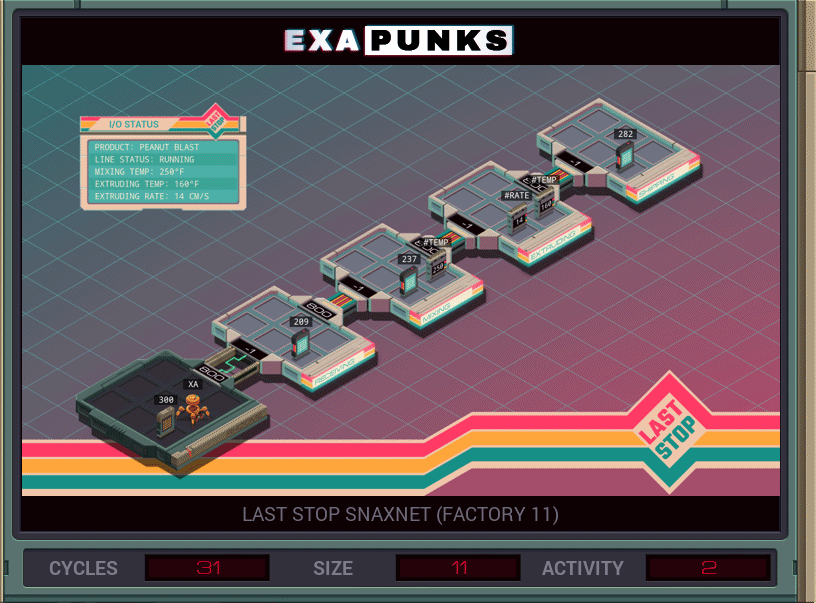

# 7: Last Stop Snaxnet (Factory 11)
<div align='center'></div>
n
## Instructions
>Remove the keyword ‗PEANUTS‗ (file 300) from the Peanut Blast recipe (file 237).
>
>Note that the target keyword will appear in a different position in each of the 100 test runs. To view and debug each of the different test runs, click the arrow buttons next to the "TEST RUN" display above.

## Solution

### [XA](XA.exa) (GLOBAL)
```asm
GRAB 300
COPY F X
WIPE
LINK 800
LINK 800
GRAB 237
MARK SEEK
TEST F = X
FJMP SEEK
SEEK -1
VOID F
```