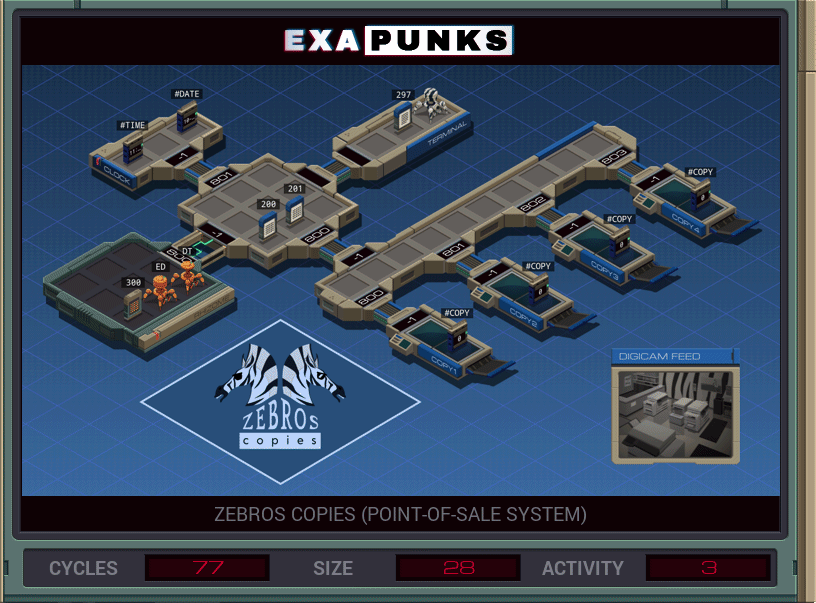

# 8: Zebros Copies (Point-Of-Sale System)
<div align='center'></div>

## Instructions
>Erase Ghast's debt to the copy shop by zeroing out his balance in the customer database (file 200) and appending a payment to the payment log (file 201) with today's date and the exact amount of his prior balance.
>
>Ghast's customer ID is available in file 300.
>
>For more information see "Network Exploration: Digicash Point-of-Sale Systems" in the first issue of the zine.

## Solution

### [XA](XA.exa) (GLOBAL)
```asm
LINK 800
LINK 800
LINK 800
COPY 250 #COPY
```

### [XB](XB.exa) (GLOBAL)
```asm
LINK 800
LINK 800
LINK 801
COPY 250 #COPY
```

### [XC](XC.exa) (GLOBAL)
```asm
LINK 800
LINK 800
LINK 802
COPY 250 #COPY
```

### [XD](XD.exa) (GLOBAL)
```asm
LINK 800
LINK 800
LINK 803
COPY 250 #COPY
```