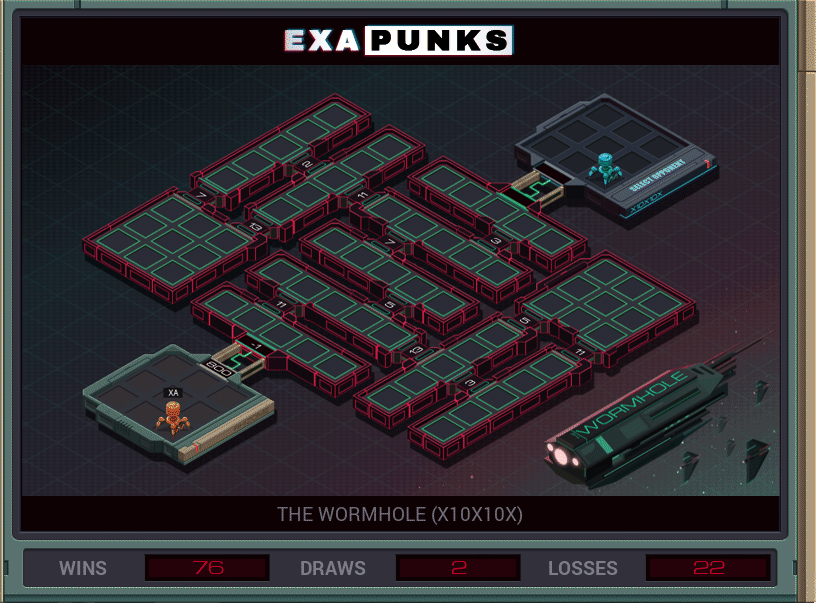

# B4: The Wormhole (X10X10X)
<div align='center'></div>
n
## Instructions
>To win this battle you must fill the network's hosts with as many of your EXAs as you can. Note that each pair of test runs has its own unique network layout, with bi-directional links between hosts that use the prime numbers between 2 and 13 as link IDs (2, 3, 5, 7, 11, and 13).
>
>     Gain one point for every EXA you control in the network at the end of the battle.
>
>     Lose one point every time one of your EXAs executes a KILL instruction.
>
>For more information see "Hacker Battle Domination" in the second issue of the zine.

## Solution

### [XA](XA.exa) (GLOBAL)
```asm
LINK 800
MARK LOOP
REPL 2
REPL 3
REPL 5
REPL 7
REPL 11
REPL 13
JUMP LOOP
MARK 2
LINK 2
JUMP LOOP
MARK 3
LINK 3
JUMP LOOP
MARK 5
LINK 5
JUMP LOOP
MARK 7
LINK 7
JUMP LOOP
MARK 11
LINK 11
JUMP LOOP
MARK 13
LINK 13
```