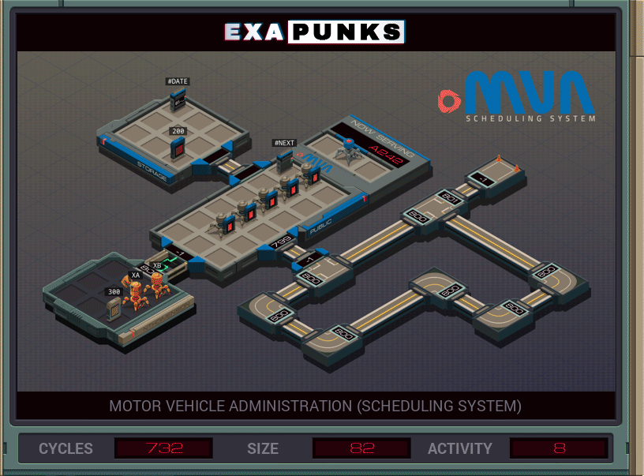

# S2: Motor Vehicle Administration (Scheduling System)
<div align='center'></div>
n
## Instructions
>There is a list of appointments (file 200) in *storage* that contains an appointment for NthDimension (file 300) to take his driving test. Remove the appointment from the list of appointments, change the date to today's date (#DATE register), and insert it between today's appointments and tomorrow's appointments.
>
>To gain access to the *storage* host you will need to unlock it by writing the lowest ticket number to the #NEXT register. Each EXA in *public* is holding a ticket; terminate them all to find the ticket of the next EXA to be served.
>
>Note that writing an incorrect ticket number to the #NEXT register will fail the _leave no trace_ requirement.

## Solution

### [XA](XA.exa) (GLOBAL)
```asm
LINK 800
KILL
KILL
KILL
KILL
KILL
COPY 200 X
MARK GRABLOOP
REPL GRAB
ADDI X 1 X
JUMP GRABLOOP


MARK GRAB
GRAB X
KILL
COPY F #NEXT
DROP
LINK 800
COPY M X
GRAB 200
MARK SEARCHNTH
TEST F = X
FJMP SEARCHNTH
COPY F M
SEEK -3
VOID F
VOID F
VOID F
SEEK -9999
MARK COPYFILE
COPY F M
TEST EOF
FJMP COPYFILE
COPY -1 M
SEEK -9999
MARK FINDSPOT
TEST F > #DATE
SEEK 2
FJMP FINDSPOT
SEEK -3
COPY 0 X
MARK COUNTSPOT
SEEK 3
SUBI X 3 X
TEST EOF
FJMP COUNTSPOT
SEEK X
COPY #DATE F
COPY M F
COPY M F
COPY X M
MARK RESTOREFILE
COPY M X
TEST X = -1
TJMP HALT
COPY X F
JUMP RESTOREFILE
MARK HALT
```

### [XB](XB.exa) (GLOBAL)
```asm
GRAB 300
COPY F M
COPY M F
DROP
MAKE
MARK COPYFILE
COPY M X
TEST X = -1
TJMP STARTWRITE
COPY X F
JUMP COPYFILE
MARK STARTWRITE
DROP
GRAB 300
COPY F M
COPY F M
WIPE
GRAB 400
SEEK 9999
SEEK M
MARK RESTOREFILE
COPY F M
TEST EOF
FJMP RESTOREFILE
COPY -1 M
```