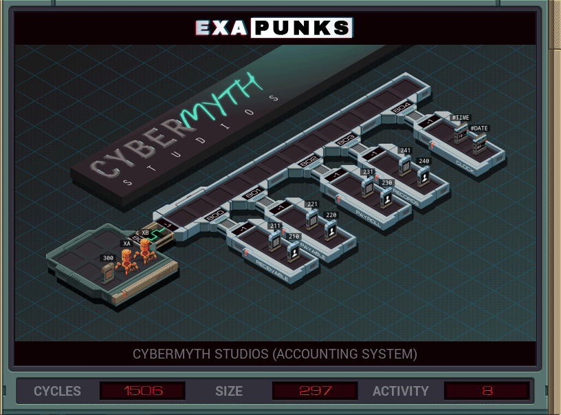

# S3: Cybermyth Studios (Accounting System)
<div align='center'></div>

## Instructions
>Each host contains two files: a list of accounts and a list of transactions. Although the entries in these files vary, the first value of each entry is a unique identifier that connects an account to one or more transactions.
>
>Determine the amount of back-pay owed to Ghast and Moss by subtracting the amount that they were paid (file 221) from the amount that they were owed (file 231). Then add their shell company (file 300) to the list of accounts payable (file 220) and issue a single payment to it for the total amount owed (file 221).
>
>Note that all monetary amounts are represented as two values: dollars, then cents.

## Solution

### [XA](XA.exa) (GLOBAL)
```asm
LINK 800
LINK 801
GRAB 220
COPY M X
MARK SEARCHGHASTP
TEST F = X
FJMP SEARCHGHASTP
SEEK -2
COPY F M
SEEK -9999
COPY M X
MARK SEARCHMOSSP
TEST F = X
FJMP SEARCHMOSSP
SEEK -2
COPY F M
DROP
LINK -1
LINK 802
GRAB 230
COPY M X
MARK SEARCHGHASTO
TEST F = X
FJMP SEARCHGHASTO
SEEK -2
COPY F M
SEEK -9999
COPY M X
MARK SEARCHMOSSO
TEST F = X
FJMP SEARCHMOSSO
SEEK -2
COPY F M
DROP
GRAB 231
COPY M X
MARK SENDGHASTO
TEST EOF
TJMP PREPMOSSO
TEST F = X
FJMP SENDGHASTO
SEEK 1
COPY F M
COPY F M
JUMP SENDGHASTO
MARK PREPMOSSO
COPY -1 M
SEEK -9999
COPY M X
MARK SENDMOSSO
TEST EOF
TJMP PREPGHASTP
TEST F = X
FJMP SENDMOSSO
SEEK 1
COPY F M
COPY F M
JUMP SENDMOSSO
MARK PREPGHASTP
COPY -1 M
DROP
LINK -1
LINK 801
GRAB 221
COPY M X
MARK SENDGHASTP
TEST EOF
TJMP PREPMOSSP
TEST F = X
FJMP SENDGHASTP
SEEK 1
COPY F M
COPY F M
JUMP SENDGHASTP
MARK PREPMOSSP
COPY -1 M
SEEK -9999
COPY M X
MARK SENDMOSSP
TEST EOF
TJMP ADDSHELL
TEST F = X
FJMP SENDMOSSP
SEEK 1
COPY F M
COPY F M
JUMP SENDMOSSP
MARK ADDSHELL
COPY -1 M
DROP
GRAB 220
SEEK 9999
SEEK -2
COPY F X
SEEK 1
ADDI X 1 F
COPY M F
DROP
GRAB 221
SEEK 9999
ADDI X 1 F
COPY M F
COPY M F
COPY M F
```

### [XB](XB.exa) (GLOBAL)
```asm
GRAB 300
COPY F M
SEEK 9999
COPY M F
SEEK -3
COPY F M
SEEK 9999
COPY M F
SEEK -9999
COPY F M
COPY M X
COPY F M
SEEK 9999
COPY X F
COPY M F
SEEK -2
COPY F M
DROP
MAKE ;400 = GHAST OWED
COPY 0 F
COPY 0 F
SEEK -2
MARK SUMGHASTO
COPY M X
TEST X = -1
TJMP PREPMOSSO
ADDI F X X
SEEK -1
COPY X F
ADDI F M X
SEEK -1
COPY X F
SEEK -2
JUMP SUMGHASTO
MARK PREPMOSSO
DROP
GRAB 300
SEEK 9999
SEEK -1
COPY F M
DROP
MAKE ;401 = MOSS OWED
COPY 0 F
COPY 0 F
SEEK -2
MARK SUMMOSSO
COPY M X
TEST X = -1
TJMP PREPGHASTP
ADDI F X X
SEEK -1
COPY X F
ADDI F M X
SEEK -1
COPY X F
SEEK -2
JUMP SUMMOSSO
MARK PREPGHASTP
DROP
GRAB 300
SEEK 3
COPY F M
DROP
MAKE ;402 = GHAST PAID
COPY 0 F
COPY 0 F
SEEK -2
MARK SUMGHASTP
COPY M X
TEST X = -1
TJMP PREPMOSSP
ADDI F X X
SEEK -1
COPY X F
ADDI F M X
SEEK -1
COPY X F
SEEK -2
JUMP SUMGHASTP
MARK PREPMOSSP
DROP
GRAB 300
SEEK 4
COPY F M
DROP
MAKE ;403 = MOSS PAID
COPY 0 F
COPY 0 F
SEEK -2
MARK SUMMOSSP
COPY M X
TEST X = -1
TJMP CALCOWED
ADDI F X X
SEEK -1
COPY X F
ADDI F M X
SEEK -1
COPY X F
SEEK -2
JUMP SUMMOSSP
MARK CALCOWED
DROP
GRAB 300
SEEK 2
COPY F M
WIPE
GRAB 402
COPY F X
COPY F T
WIPE
GRAB 400
SUBI F X X
SUBI F T T
DIVI T 100 F
COPY T F
TEST T < 0
FJMP SKIP1
SEEK -1
MODI F 100 T
TEST T = 0
TJMP SKIP1
SEEK -2
SUBI F 1 T
SEEK -1
COPY T F
SEEK 1
MARK SKIP1
SEEK -1
COPY F T
SEEK -2
ADDI X F X
MODI T 100 T
SEEK -3
COPY X F
COPY T F
VOID F
DROP ;400 = GHAST OWED
GRAB 403
COPY F X
COPY F T
WIPE
GRAB 401
SUBI F X X
SUBI F T T
DIVI T 100 F
COPY T F
TEST T < 0
FJMP SKIP2
SEEK -1
MODI F 100 T
TEST T = 0
TJMP SKIP2
SEEK -2
SUBI F 1 T
SEEK -1
COPY T F
SEEK 1
MARK SKIP2
SEEK -1
COPY F T
SEEK -2
ADDI X F X
MODI T 100 T
WIPE ;MEM = MOSS OWED
GRAB 400
ADDI X F X
ADDI T F T
DIVI T 100 F
COPY T F
TEST T < 0
FJMP SKIP3
SEEK -1
MODI F 100 T
TEST T = 0
TJMP SKIP3
SEEK -2
SUBI F 1 T
SEEK -1
COPY T F
SEEK 1
MARK SKIP3
SEEK -1
COPY F T
SEEK -2
ADDI X F X
MODI T 100 T
WIPE ;MEM = TOTAL OWED
LINK 800
LINK 804
COPY #DATE M
COPY X M
COPY T M
```