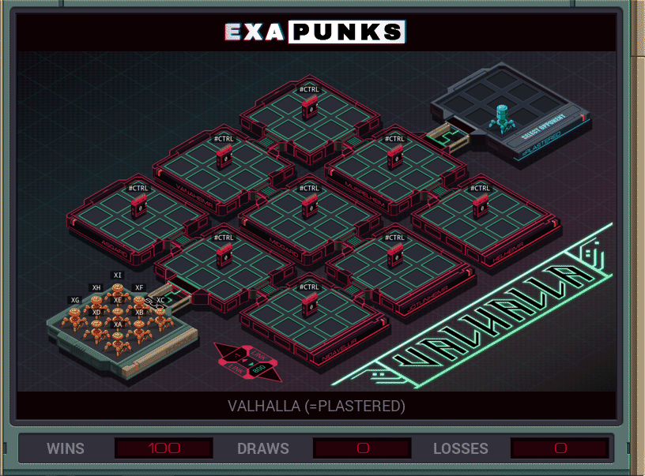

# B2: Valhalla (=Plastered)
<div align='center'></div>

## Instructions
>To win this battle you must control a majority of the hosts for as long as possible. 
>
>To take control of a host, write any value to its #CTRL register. Reading from a #CTRL register will tell if you (1) or your opponent (-1) controls the host.
>
>     Gain one point every cycle you control more hosts than your opponent.
>
>     Lose one point every time one of your EXAs executes a KILL instruction.
>
>For more information see "Hacker Battle Domination" in the second issue of the zine.

## Solution

### [XA](XA.exa) (GLOBAL)
```asm
LINK 800
LINK -1
MARK LOOP
COPY 1 #CTRL
JUMP LOOP
```

### [XB](XB.exa) (GLOBAL)
```asm
LINK 800
MARK LOOP
COPY 1 #CTRL
JUMP LOOP
```

### [XC](XC.exa) (GLOBAL)
```asm
LINK 800
LINK 800
MARK LOOP
COPY 1 #CTRL
JUMP LOOP
```

### [XD](XD.exa) (GLOBAL)
```asm
@REP 3
LINK 800
@END
MARK LOOP
COPY 1 #CTRL
JUMP LOOP
```

### [XE](XE.exa) (GLOBAL)
```asm
@REP 4
LINK 800
@END
MARK LOOP
COPY 1 #CTRL
JUMP LOOP
```

### [XF](XF.exa) (GLOBAL)
```asm
@REP 5
LINK 800
@END
MARK LOOP
COPY 1 #CTRL
JUMP LOOP
```

### [XG](XG.exa) (GLOBAL)
```asm
@REP 6
LINK 800
@END
MARK LOOP
COPY 1 #CTRL
JUMP LOOP
```

### [XH](XH.exa) (GLOBAL)
```asm
@REP 7
LINK 800
@END
MARK LOOP
COPY 1 #CTRL
JUMP LOOP
```

### [XI](XI.exa) (GLOBAL)
```asm
@REP 8
LINK 800
@END
MARK LOOP
COPY 1 #CTRL
JUMP LOOP
```