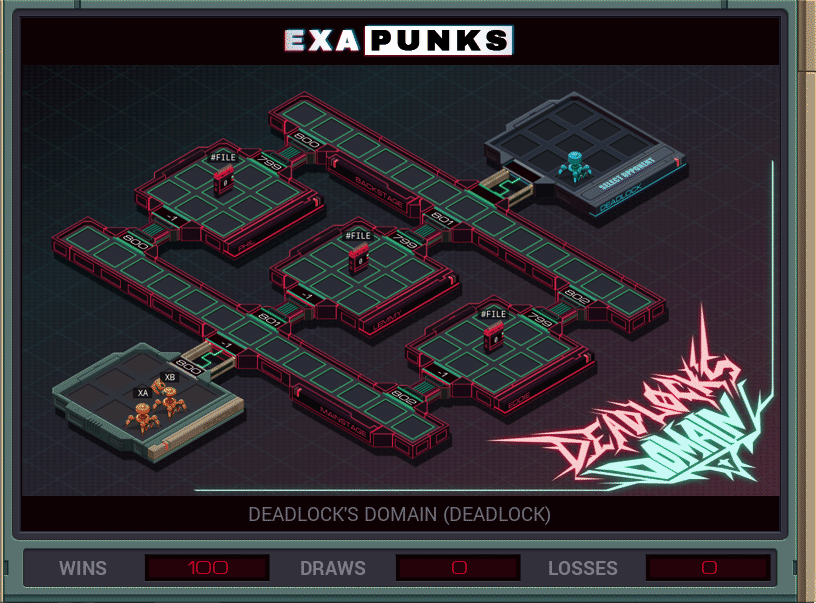

# B3: Deadlock's Domain (Deadlock)
<div align='center'></div>

## Instructions
>To win this battle you must grab files as they spawn in the central hosts and bring them back to your host. 
>
>Reading the #FILE register will tell you the ID of the most recently created file currently in that host.
>
>     Gain one point for every file you bring back to your host.
>
>     Lose one point every time one of your EXAs executes a KILL instruction.
>
>For more information see "Hacker Battle Domination" in the second issue of the zine.

## Solution

### [XA](XA.exa) (GLOBAL)
```asm
LINK 800
LINK 801
MARK LOOP
REPL GRAB
JUMP LOOP

MARK GRAB
GRAB #FILE
LINK -1
LINK -1
```

### [XB](XB.exa) (GLOBAL)
```asm
LINK 800
LINK 800
LINK 799
KILL
KILL
KILL
```