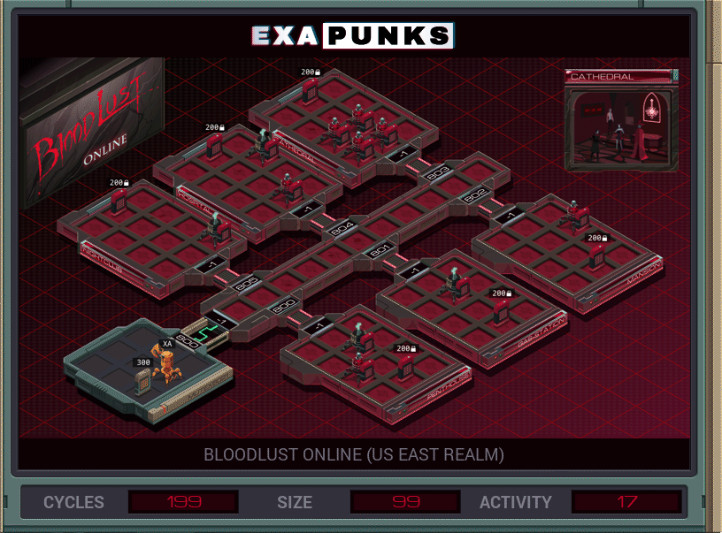

# S1: Bloodlust Online (US East Realm)
<div align='center'></div>

## Instructions
>Each host contains an item listing (file 200) that lists all of the items in that location (ID, type, and state).
>
>First, locate mutex8021's hideout by finding the ‗TALISMAN‗ (file 300). Then find the ‗MAP‗ in the hideout and use it to locate the target host: the secret vampire lair. Next, travel to the target host, disconnect the vampire players by terminating their EXAs, set the ‗DOOR‗ to be ‗UNLOCKED‗, and copy the ‗SAFE‗ combination to the ‗CLOCK‗ so that mutex8021 can read it and empty the safe.
>
>Note that the door to mutex8021's hideout will always be ‗UNLOCKED‗.

## Solution

### [XA](XA.exa) (GLOBAL)
```asm
GRAB 300
LINK 800
COPY F X
@REP 6
COPY @{800,1} T
REPL FINDMUTEX
@END
VOID M
COPY F M
COPY M X
COPY F M
SEEK -2
COPY M F
@REP 6
COPY @{800,1} T
REPL FINDHIDEOUT
@END
VOID M
COPY F M
SEEK -2
COPY F M
SEEK 1
COPY F M
COPY M X
COPY F M
COPY X M
WIPE
HALT

MARK FINDMUTEX
LINK T
GRAB 200
SEEK 1
MARK SEARCHTALISMAN
TEST F = X
FJMP SEARCHTALISMAN
SEEK -9999
COPY 200 M
COPY M X
SEEK 1
MARK SEARCHMAP
TEST F = X
FJMP SEARCHMAP
COPY F M
COPY M X
SEEK -9999
SEEK 1
MARK SEARCHMDOOR
TEST F = X
FJMP SEARCHMDOOR
COPY F M
HALT

MARK FINDHIDEOUT
LINK T
HOST T
TEST X = T
FJMP HALT
@REP 4
KILL
@END
GRAB 200
COPY 200 M
COPY M X
SEEK 1
MARK SEARCHHDOOR
TEST F = X
FJMP SEARCHHDOOR
COPY M F
SEEK -9999
COPY M X
SEEK 1
MARK SEARCHSAFE
TEST F = X
FJMP SEARCHSAFE
COPY F M
SEEK -9999
COPY M X
SEEK 1
MARK SEARCHCLOCK
TEST F = X
FJMP SEARCHCLOCK
COPY M F

MARK HALT
```