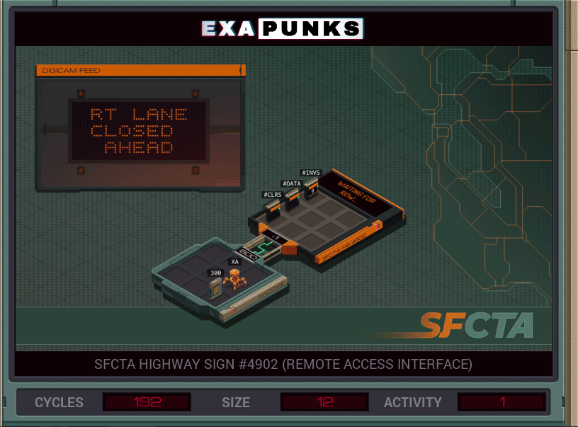

# 09: SFCTA Highway Sign #4902 (Remote Access Interface)
<div align='center'></div>

## Instructions
>Write EMBER-2's message (file 300) to the highway sign. The file contains one character value for each position on the sign from left to right, top to bottom.
>
>For more information see "Hardware Hacks: Electronic Highway Signs" in the first issue of the zine.

## Solution

### [XA](XA.exa) (GLOBAL)
```asm
GRAB 300
LINK 800
MARK WRITE
DIVI X 9 #DATA
MODI X 9 #DATA
ADDI X 1 X
COPY F #DATA
TEST EOF
TJMP HALT
JUMP WRITE
MARK HALT
WIPE
```