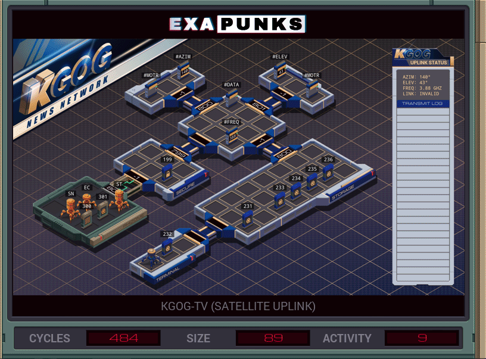

# 25: KGOG-TV (Satellite Uplink)
<div align='center'></div>

## Instructions
>Align the satellite dish with the target satellite by setting the azimuth, elevation, and frequency. Then transmit the data from EMBER-2's video (file 301) after encrypting it using the TV station's encryption key (file 199).
>
>The azimuth, elevation, and frequency of the target satellite are available in file 300.
>
>Note that you must align the satellite dish before transmitting any data.
>
>For more information see "Look to the Stars with Satellite Uplink Systems" in the second issue of the zine.

## Solution

### [ST](ST.exa) (GLOBAL)
```asm
GRAB 300
LINK 800
LINK 799
LINK 800
SEEK 1
SUBI F #AZIM X
TEST X < 0
TJMP AZIMDOWN
MARK AZIMUP
TEST X = 0
TJMP AZIMDONE
COPY 1 #MOTR
SUBI X 1 X
JUMP AZIMUP
MARK AZIMDOWN
TEST X = 0
TJMP AZIMDONE
COPY -1 #MOTR
ADDI X 1 X
JUMP AZIMDOWN
MARK AZIMDONE
LINK -1
LINK 801
SEEK 1
SUBI F #ELEV X
TEST X < 0
TJMP ELEVDOWN
MARK ELEVUP
TEST X = 0
TJMP ELEVDONE
COPY 1 #MOTR
SUBI X 1 X
JUMP ELEVUP
MARK ELEVDOWN
TEST X = 0
TJMP ELEVDONE
COPY -1 #MOTR
ADDI X 1 X
JUMP ELEVDOWN
MARK ELEVDONE
LINK -1
SEEK 1
COPY F #FREQ
COPY 200 M
WIPE
```

### [SN](SN.exa) (LOCAL)
```asm
GRAB 301
LINK 800
SEEK 1
MARK LOOP
SUBI 9999 M X
SUBI X F X
TEST X > 0
TJMP HIGHER
MULI X -1 X
SUBI X 1 X
MARK WRITE
SEEK -1
COPY X F
TEST EOF
TJMP NEXT
COPY 10 M
JUMP LOOP
MARK HIGHER
SUBI X 9999 X
MULI X -1 X
JUMP WRITE
MARK NEXT
COPY -1 M
MODE
VOID M
LINK 799
SEEK -9999
SEEK 1
MARK SEND
COPY F #DATA
TEST EOF
FJMP SEND
WIPE
```

### [EC](EC.exa) (LOCAL)
```asm
LINK 800
GRAB 199
MARK LOOP
COPY F M
TEST M = -1
TJMP HALT
TEST EOF
FJMP LOOP
SEEK -9999
JUMP LOOP
MARK HALT
```