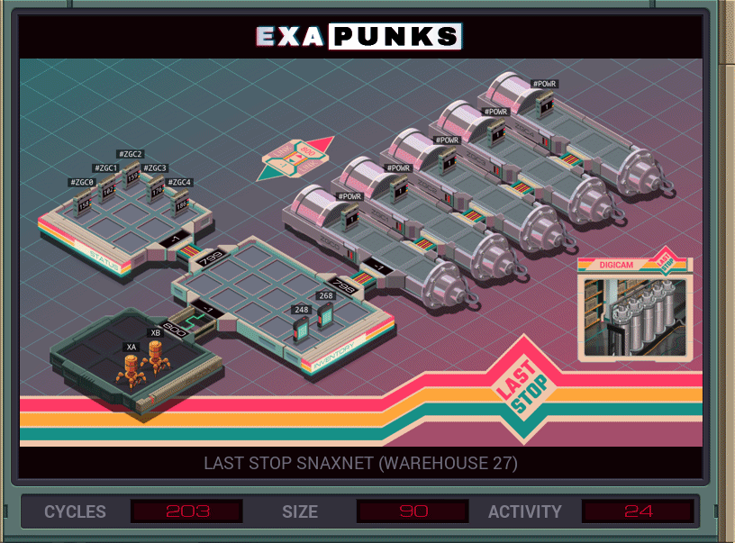

# 28: Last Stop Snaxnet (Warehouse 27)
<div align='center'></div>

## Instructions
>An array of five Zippe-type gas centrifuges, ZGC0 through ZGC4, are connected in a cascade configuration.
>
>Read each of the #ZGCX registers and determine which centrifuge currently has the highest pressure. Then disable that centrifuge's regulator by writing a value of 0 to its #POWR register. Repeat this process until all five regulators have been disabled.

## Solution

### [XA](XA.exa) (GLOBAL)
```asm
LINK 800
LINK 798
MARK LOOP
COPY 200 M
COPY M X
TEST X = 0
TJMP KILL0
TEST X = 1
TJMP KILL1
TEST X = 2
TJMP KILL2
TEST X = 3
TJMP KILL3
TEST X = 4
TJMP KILL4
HALT
MARK KILL0
COPY 0 #POWR
JUMP LOOP
MARK KILL1
LINK 800
COPY 0 #POWR
LINK -1
JUMP LOOP
MARK KILL2
LINK 800
LINK 800
COPY 0 #POWR
LINK -1
LINK -1
JUMP LOOP
MARK KILL3
@REP 3
LINK 800
@END
COPY 0 #POWR
@REP 3
LINK -1
@END
JUMP LOOP
MARK KILL4
@REP 4
LINK 800
@END
COPY 0 #POWR
@REP 4
LINK -1
@END
JUMP LOOP
```

### [XB](XB.exa) (GLOBAL)
```asm
LINK 800
LINK 799
MAKE
MARK LOOP
VOID M
COPY #ZGC0 X
COPY 0 F
SEEK -1
@REP 4
TEST #ZGC@{1,1} > X
FJMP SKIP@{1,1}
COPY #ZGC@{1,1} X
COPY @{1,1} F
SEEK -1
MARK SKIP@{1,1}
@END
TEST X = 0
TJMP HALT
COPY F M
JUMP LOOP
MARK HALT
COPY -1 M
WIPE
```